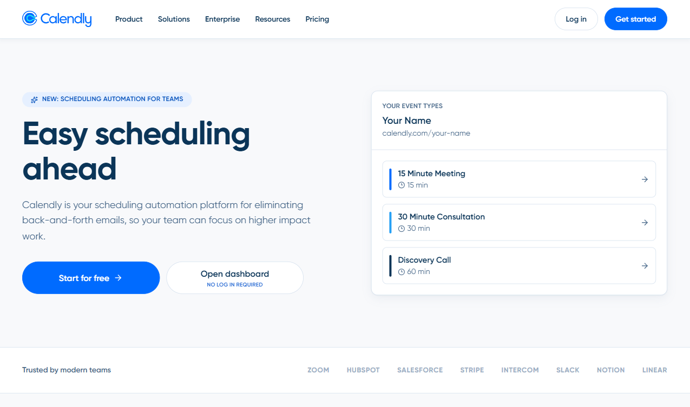
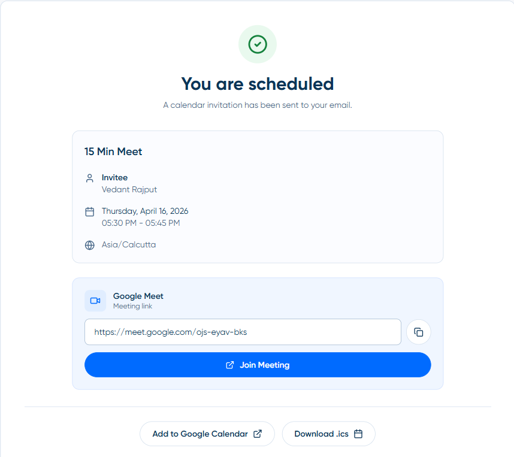
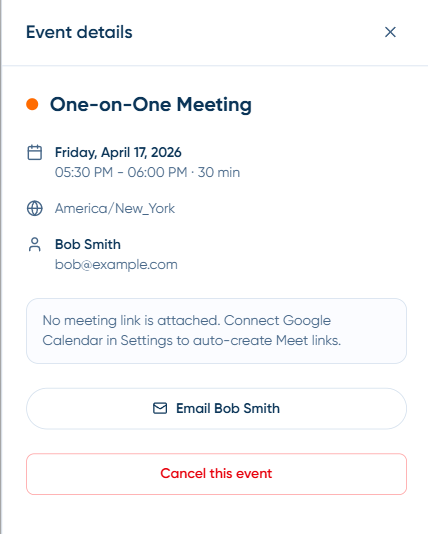
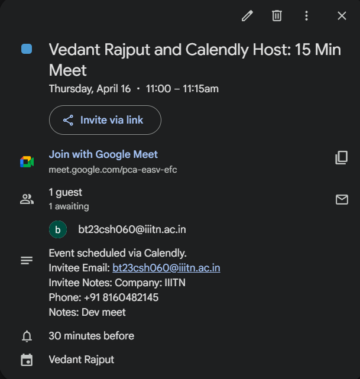

# Scheduling Platform (Calendly Clone)

SDE Intern Fullstack Assignment submission. This project replicates Calendly-style scheduling flows, UI patterns, and booking interactions with a full-stack architecture.

## Live Links

- Frontend (Vercel): https://calendly-sepia-nine.vercel.app
- Backend API (Render): https://calendly-24r9.onrender.com
- Health Check: https://calendly-24r9.onrender.com/api/health

## Tech Stack

- Frontend: Next.js 16 (App Router), TypeScript
- Backend: Node.js + Express 5, TypeScript
- Database: PostgreSQL (Neon) + Prisma
- Security: Helmet, compression, express-rate-limit
- Integrations: Google OAuth + Google Calendar/Meet, SMTP email notifications

## Assignment Compliance

### Core Features (Must Have)

1. Event Types Management

- Create event types with name, duration, and slug
- Edit/delete event types
- List event types in dashboard
- Unique public booking link per event type (`/[slug]`)

2. Availability Settings

- Weekly day-wise availability
- Time windows per day
- Timezone configuration

3. Public Booking Page

- Calendar date selection
- Available slots per selected date
- Invitee form (name, email, optional custom fields)
- Double-booking prevention
- Booking confirmation page

4. Meetings Page

- Upcoming meetings
- Past meetings
- Cancellation flow

### Bonus Features (Implemented)

- Responsive design (mobile/tablet/desktop)
- Multiple availability windows per day
- Date override hours / blocked dates
- Reschedule flow
- Email notifications (booking + cancellation)
- Buffer time before/after meetings
- Custom invitee questions
- Google Calendar sync + Meet link generation

## Project Structure

- `frontend/`: Next.js application (admin + public booking UI)
- `backend/`: Express API, Prisma schema/migrations/seed
- `docs/`: screenshots and ER-Diagram

## Architecture

- Frontend is deployed on Vercel
- Backend is deployed on Render Web Service
- Database is Neon PostgreSQL
- Frontend communicates with backend via `/api/proxy/[...path]` and direct backend API URL

Request flow:

1. User interacts with frontend (Vercel)
2. Frontend invokes backend endpoints
3. Backend validates logic + writes/reads PostgreSQL
4. Optional integrations trigger (email, Google Calendar)

## Local Setup

### 1) Backend

```bash
cd backend
npm install
```

Create `backend/.env`:

```env
DATABASE_URL=postgresql://<runtime-pooled-url>
DIRECT_DATABASE_URL=postgresql://<direct-url-for-migrations>
PORT=3001
FRONTEND_URL=http://localhost:3000

GOOGLE_CLIENT_ID="..."
GOOGLE_CLIENT_SECRET="..."
GOOGLE_CALENDAR_REFRESH_TOKEN="..." # optional

SMTP_HOST=smtp.gmail.com
SMTP_PORT=587
SMTP_USER=your-email@gmail.com
SMTP_PASS=your-app-password
HOST_EMAIL=host@example.com

```

Run migrations and seed:

```bash
npx prisma migrate deploy
npm run seed
```

Start backend:

```bash
npm run dev
```

### 2) Frontend

```bash
cd frontend
npm install
```

Create `frontend/.env.local`:

```env
NEXT_PUBLIC_API_URL=http://localhost:3001/api
DATABASE_URL=postgresql://<same-db-or-frontend-auth-db-url>

NEXTAUTH_URL=http://localhost:3000
NEXTAUTH_SECRET=replace-with-strong-secret

GOOGLE_CLIENT_ID="..."
GOOGLE_CLIENT_SECRET="..."

ASSIGNMENT_DEFAULT_USER_ID=default-user-id
```

Start frontend:

```bash
npm run dev
```

## Deployment Guide (Current Setup)

### Frontend (Vercel)

- Root directory: `frontend`
- Framework: Next.js
- Build command: `npm run build`
- Install command: `npm install`

Required Vercel env vars:

- `NEXT_PUBLIC_API_URL=https://calendly-24r9.onrender.com/api`
- `NEXTAUTH_URL=https://calendly-sepia-nine.vercel.app`
- `NEXTAUTH_SECRET=<strong-random-secret>`
- `DATABASE_URL=<postgres-url>`
- `GOOGLE_CLIENT_ID=<...>`
- `GOOGLE_CLIENT_SECRET=<...>`
- `ASSIGNMENT_DEFAULT_USER_ID=default-user-id`

### Backend (Render)

- Service type: Web Service
- Root directory: `backend`
- Build command:

```bash
npm install && npx prisma migrate deploy && npm run prisma:generate && npm run build
```

- Start command:

```bash
npm run start
```

Required Render env vars:

- `DATABASE_URL`
- `DIRECT_DATABASE_URL`
- `FRONTEND_URL=https://calendly-sepia-nine.vercel.app`
- `GOOGLE_CLIENT_ID`
- `GOOGLE_CLIENT_SECRET`
- `SMTP_HOST`, `SMTP_PORT`, `SMTP_USER`, `SMTP_PASS`, `HOST_EMAIL` (if email is enabled)

## API Routes

- `GET /api/event-types`
- `POST /api/event-types`
- `PUT /api/event-types/:id`
- `DELETE /api/event-types/:id`
- `GET /api/event-types/:slug`
- `GET /api/availability`
- `PUT /api/availability`
- `GET /api/availability/date-overrides`
- `POST /api/availability/date-overrides`
- `DELETE /api/availability/date-overrides/:id`
- `GET /api/available-slots?slug=:slug&date=:date`
- `POST /api/bookings`
- `GET /api/bookings/upcoming`
- `GET /api/bookings/past`
- `GET /api/bookings/:id`
- `PATCH /api/bookings/:id/cancel`
- `GET /api/bookings/cancel-token/:cancelToken`
- `PATCH /api/bookings/cancel-token/:cancelToken`
- `PATCH /api/bookings/cancel-token/:cancelToken/reschedule`
- `GET /api/health`

## Core Screens

- `/dashboard`: event type management
- `/availability`: weekly hours + timezone + date overrides
- `/meetings`: upcoming/past meetings + cancel actions
- `/[slug]`: public booking page
- `/booking-confirmed/[bookingId]`: confirmation details
- `/cancel/[cancelToken]`: cancel/reschedule flow

## ER Diagram


## UI Screenshots
### 1) Landing Page (`/`)



### 2) Dashboard - Event Types (`/dashboard`)


### 3) Availability - Weekly Hours (`/availability`)


### 4) Availability - Date Overrides (`/availability`)


### 5) Meetings - Upcoming (`/meetings`)


### 6) Public Booking Page (`/[slug]`)


### 7) Booking Confirmation (`/booking-confirmed/[bookingId]`)



### 8) Cancel or Reschedule (`/cancel/[cancelToken]`)



### 9) Settings - Google Calendar (`/settings`)


### 10) Confirmation Email


### 11) Google Calendar Event



## Design Notes

- Slot generation includes timezone handling, availability windows, date overrides, overlap filtering, and buffer filtering.
- Double-booking prevention is handled with transactional checks + locking semantics before create.
- Admin side supports assignment mode (no-login default user simulation) as required.

## Assumptions

- No-login admin mode uses `ASSIGNMENT_DEFAULT_USER_ID` as fallback.
- Timestamps are persisted in UTC, displayed with relevant timezone context.
- SMTP and Google sync are optional and fail gracefully when not configured.
